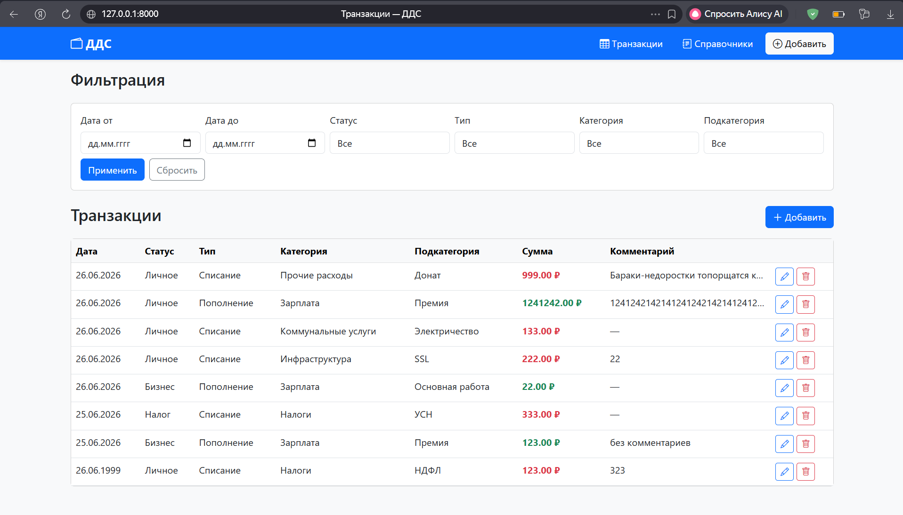
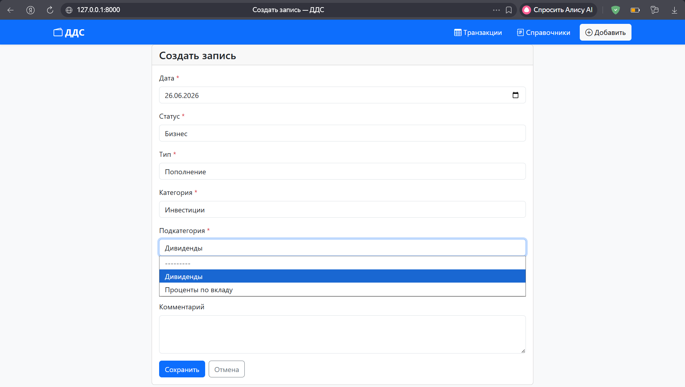
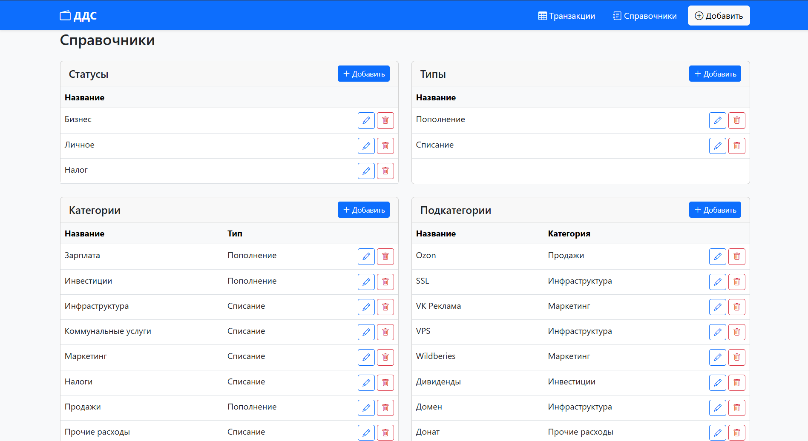

# Движение денежных средств

Веб-приложение для управления движением денежных средств (ДДС), разработанное на **Python** с использованием **Django**.

Проект реализует учет доходов и расходов, управление справочниками, фильтрацию операций и соблюдение логических зависимостей между сущностями.

---

## Возможности

### Управление транзакциями

* Создание записи о движении денежных средств
* Редактирование существующих записей
* Удаление записей
* Просмотр списка всех операций

### Управление справочниками

* Статусы
* Типы операций
* Категории
* Подкатегории

Для каждого справочника реализован полный CRUD.

### Фильтрация

Поддерживается фильтрация операций по:

* диапазону дат;
* статусу;
* типу операции;
* категории;
* подкатегории.


### Пользовательский интерфейс

* Bootstrap 5
* Адаптивный интерфейс
* Уведомления об успешных и ошибочных действиях
* Динамическая загрузка категорий и подкатегорий (AJAX)

---

# Используемые технологии

* Python 3
* Django
* Django ORM
* SQLite
* Bootstrap 5
* HTML5
* CSS3
* JavaScript

---

# 🚀 Установка проекта

## 1. Клонировать репозиторий

```bash
git clone <ссылка_на_репозиторий>

cd dds
```

---

## 2. Создать виртуальное окружение

### Windows

```bash
python -m venv venv

venv\Scripts\activate
```

---

## 3. Установить зависимости

```bash
pip install -r requirements.txt
```

---

## 3. Создать файл .env

```bash
В корне проекта создайте файл .env и добавьте в него:

SECRET_KEY=ваш_secret_key

При необходимости новый SECRET_KEY можно сгенерировать командой: 

python -c "from django.core.management.utils import get_random_secret_key; 

print(get_random_secret_key())"
```

---

## 5. Применить миграции

```bash
python manage.py migrate
```

---

## 6. Запустить сервер

```bash
python manage.py runserver
```

После запуска приложение будет доступно по адресу:

```
http://127.0.0.1:8000/
```

---

# Создание администратора (необязательно)

Для доступа к административной панели Django выполните:

```bash
python manage.py createsuperuser
```

После этого откройте:

```
http://127.0.0.1:8000/admin/
```

---


# Основной функционал

* Учет поступлений и списаний денежных средств
* Работа со справочниками
* Валидация данных на стороне клиента и сервера
* AJAX-загрузка зависимых категорий и подкатегорий
* Защита от удаления используемых справочников
* Удобная фильтрация записей

---

# Интерфейс

### Главная страница




### Создание транзакции 



### Справочник

